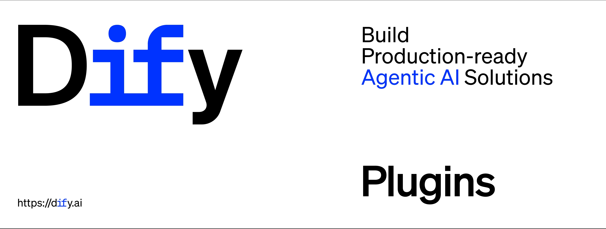

  <a href="https://cloud.dify.ai">Dify Cloud</a> ·
  <a href="https://docs.dify.ai/getting-started/install-self-hosted">Self-hosting</a> ·
  <a href="https://docs.dify.ai">Documentation</a> ·
  <a href="https://udify.app/chat/22L1zSxg6yW1cWQg">Enterprise inquiry</a>

    
    
    
    
    
    
    
    
    
    

### Introducing Dify Plugins

[Dify](https://dify.ai/) is an open-source platform for developing LLM-powered AI applications, designed to help developers and businesses efficiently build, deploy, and manage AI-driven solutions. With Dify, users can easily create and test complex AI workflows, integrate a wide range of advanced models and tools, and optimize their performance in real-world applications. The platform offers an intuitive interface, supporting RAG (Retrieval-Augmented Generation) pipelines, intelligent agent capabilities, and robust model management, enabling developers to seamlessly transition from prototype to production.

[Dify Marketplace](https://marketplace.dify.ai/) is a vibrant center that allows developers, businesses, and AI enthusiasts to explore, share, and deploy plugins designed to enhance Dify Apps' capabilities. It serves as a platform where users can discover a wide range of models, tools, agent strategies, extensions, and bundles, all of which can be seamlessly integrated into their AI applications. By providing a collaborative space for both official and community-contributed plugins, the Dify Marketplace encourages innovation and resource sharing. 

### Plugin Development

#### Types of Plugin

##### Models

These plugins integrate various AI models (including mainstream LLM providers and custom model) to handle configuration and requests for LLM APIs. For more on creating a model plugin, take refer to [Quick Start: Model Plugin](https://docs.dify.ai/plugins/quick-start/develop-plugins/model-plugin).

##### Tools

Tools refer to third-party services that can be invoked by Chatflow, Workflow, or Agent-type applications. They provide a complete API implementation to enhance the capabilities of Dify applications. For example, developing a Google Search plugin, please refer to [Quick Start: Tool Plugin](https://docs.dify.ai/plugins/quick-start/develop-plugins/tool-plugin).

##### Agent Strategies

The Agent Strategy plugin defines the reasoning and decision-making logic within an Agent node, including tool selection, invocation, and result processing.

Agent strategy plugins define the internal reasoning and decision-making logic within agent nodes. They encompass the logic for tool selection, invocation, and handling of returned results by the LLM. For further development guidance, please refer to the [Quick Start: Agent Strategy Plugin](https://docs.dify.ai/plugins/quick-start/develop-plugins/agent-strategy-plugin).

##### Extensions

Lightweight plugins that only provide endpoint capabilities for simpler scenarios, enabling fast expansions via HTTP services. This approach is ideal for straightforward integrations requiring basic API invoking. For more details, refer to [Quick Start: Extension Plugin](https://docs.dify.ai/plugins/quick-start/develop-plugins/extension-plugin).

##### Bundles

A “plugin bundle” is a collection of multiple plugins. Bundles allow you to install a curated set of plugins all at once—no more adding them one by one. For more information on creating plugin bundles, see [Plugin Development: Bundle Plugin](https://docs.dify.ai/plugins/quick-start/develop-plugins/bundle).

#### Plugin Docs

Check the [Plugins documentation](https://docs.dify.ai/plugins/quick-start/develop-plugins) to learn how to develop and publish plugins.

#### Listing Plugins in Dify Marketplace

To publish your plugin on the Dify Marketplace, follow these steps:

1. Develop and test your plugin according to the [Plugin Developer Guidelines](https://docs.dify.ai/plugins/publish-plugins/publish-to-dify-marketplace/plugin-developer-guidelines).

2. Write a [Plugin Privacy Policy](https://docs.dify.ai/plugins/publish-plugins/publish-to-dify-marketplace/plugin-privacy-protection-guidelines) for your plugin in line with Dify’s privacy policy requirements. In your plugin’s [Manifest](https://docs.dify.ai/plugins/schema-definition/manifest) file, include the file path or URL for this privacy policy.

3. Package your plugin for distribution.

4. Fork the this repository.

5. Create an organization directory under the repository’s main structure, then create a subdirectory named after your plugin. Place your plugin’s source code and the packaged `.pkg` file in that subdirectory.

6. Submit a Pull Request (PR) following the required PR template format, then wait for the review;

7. Once approved, your plugin code will merge into the main branch, and the plugin will be automatically listed on the [Dify Marketplace](https://marketplace.dify.ai/).

### Security disclosure

To protect your privacy, please avoid posting security issues on GitHub. Instead, send your questions to [security@dify.ai](mailto:security@dify.ai) and we will provide you with a more detailed answer.
